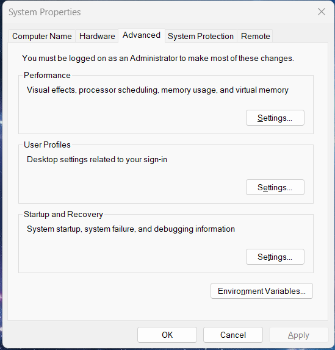
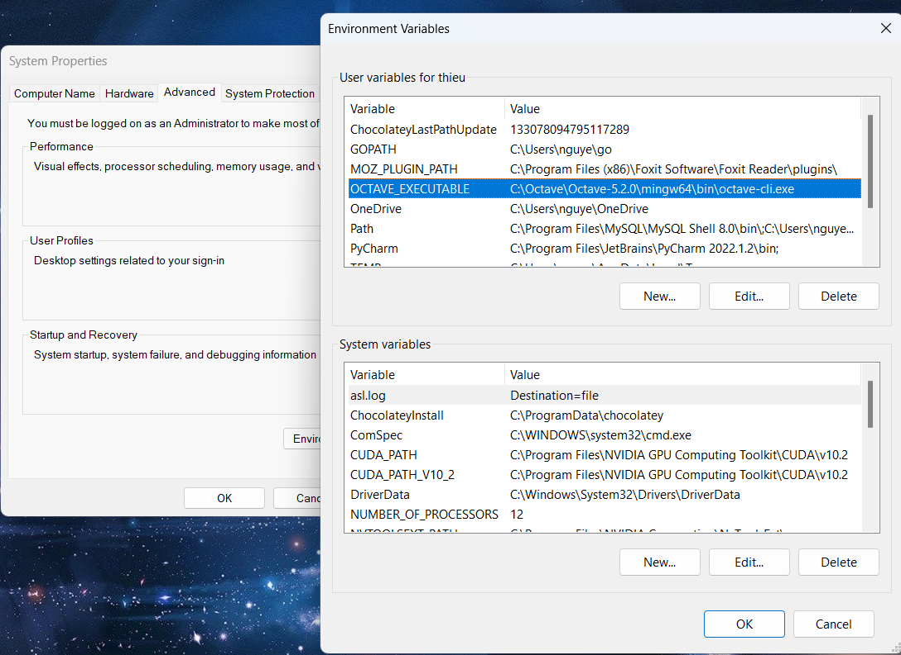
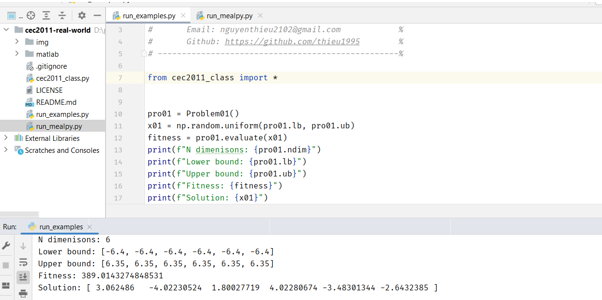
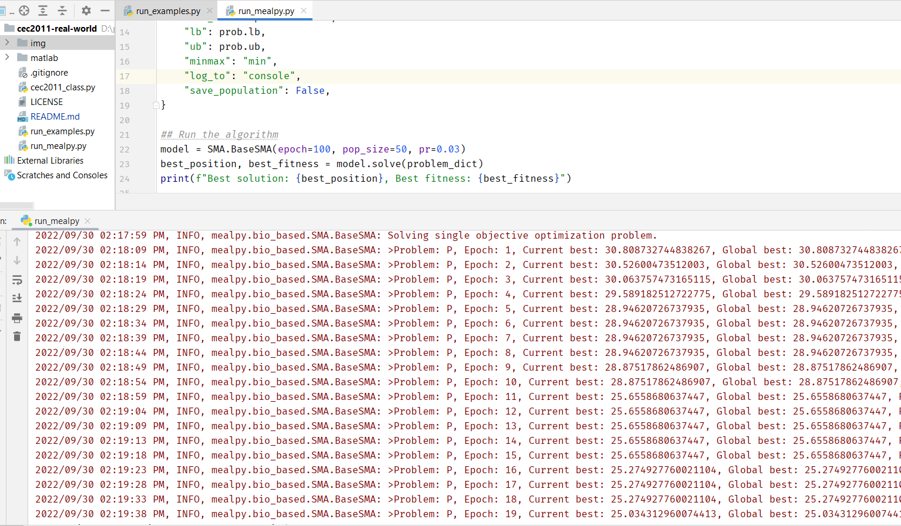

# Install environments

```code
pip install numpy
pip install oct2py
```

After that, you need to install the octave and set up the path to the octave-cli


### On Windows 

```code 
1. Download the octave from here: https://octave.org/download
2. Install it (default is on C:\ drive)
3. Setup the path to the octave-cli. 
    + Search google how to access to: Environment Variables windows (Your version)
    + In tab User variables: click New
    + Add variable name: OCTAVE_EXECUTABLE
    + And variable value: C:\Octave\Octave-5.2.0\mingw64\bin\octave-cli.exe  (This is my path, change with your path).
    + Save it and restart your computer.
```

### On Ubuntu/Linux

```code 
1. Search google how to install Octave on ubuntu/linux.
2. For example: 
    + https://vitux.com/how-to-install-gnu-octave-in-ubuntu/
    + https://blog.eldernode.com/install-gnu-octave-on-ubuntu-20-04/
```


# How to use

```code 
Add your Algorithms/Optimizers in current directory (in folder: cec2011-real-world/)
See the run_examples.py to know how to create the problem class and how to use it.
```

### Simple example with 1 problem

```python 
from cec2011_class import Problem01

## Create object 
prolem = Problem01()

## Get the ndim, lowerbound, upperbound
print(f"N dimenisons: {prolem.ndim}")
print(f"Lower bound: {prolem.lb}")
print(f"Upper bound: {prolem.ub}")

## Create a random solution
X = np.random.uniform(prolem.lb, prolem.ub)
print(f"Solution: {X}")

## Calculate the fitness value
fitness = prolem.evaluate(X)
print(f"Fitness: {fitness}")
```

### How to use with MEALPY library

Need to install mealpy: 

```code 
pip install mealpy==2.5.0
```

After that, just use it

```python 
from cec2011_class import Problem01
from mealpy.bio_based import SMA


## Define the problem dictionary
prob = Problem01()
problem_dict = {
    "fit_func": prob.evaluate,
    "lb": prob.lb,
    "ub": prob.ub,
    "minmax": "min",
    "log_to": "console",
    "save_population": False,
}


## Run the algorithm
model = SMA.BaseSMA(epoch=100, pop_size=50, pr=0.03)
best_position, best_fitness = model.solve(problem_dict)
print(f"Best solution: {best_position}, Best fitness: {best_fitness}")
```

## Images

<p align="center">

</p>

<p align="center">

</p>

<p align="center">

</p>

<p align="center">

</p>


